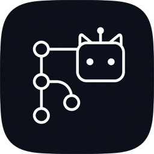

<p align="center">
  
</p>

# GitAgent

**A Git-oriented agent that harnesses AI on your iPhone, iPad, or Mac to operate git repositories — local repos on devices across your LAN, or hosted repos online (GitHub).**

Instead of tapping through git UIs or SSH-ing into machines, you tell GitAgent what you want in natural language. The agent plans and executes the git work for you: inspect history, review changes, commit, branch, push — on the machine in front of you, on another device in your local network, or against a remote hosting service.

## Vision

Git is everywhere, but driving it is still manual: every device has its own repos, its own state, its own terminal. GitAgent turns an iOS/macOS device into the control point:

- **Agent-first, not UI-first** — the primary interface is intent ("show me what changed on the office Mac since yesterday", "commit and push the fix on the NAS"), not buttons and menus
- **LAN-wide reach** — discover and operate git repositories on other devices in your local network: check status, pull, commit, resolve routine operations remotely
- **Online repos too** — the same agent drives hosted repositories (GitHub) through their APIs, so local and remote work live in one place
- **Runs where you are** — a native Swift app on iOS and macOS, no cloud relay required for LAN operations

## Where it is today

The current codebase is the foundation the agent is built on — a native GitHub client:

- GitHub sign-in via OAuth Device Flow (in-app browser or system browser, token in the system Keychain)
- Browse your own/private repositories and repositories you have starred
- In-app repository browser: README and file preview with full Markdown rendering, in-document anchor jumps, and link routing that keeps everything inside the app (files, folders, and repos open below the pinned README/Files picker)
- Profile view with the GitHub contribution graph (GraphQL)

**AI Chat is wired in:**

- Multi-provider LLM support — Kimi Code, Moonshot AI, OpenAI, DeepSeek, Anthropic, or any OpenAI-compatible endpoint (Custom). Provider picked from a menu; models fetched automatically from the API
- Multiple chat sessions persisted locally; answers stream in with full Markdown rendering
- **Repository context via @ and /** — type `@` to pick a repository (adds its README to the prompt), then `/` to attach files or folders from it (a folder contributes its README when it has one). The prompt template puts your text first, referenced content after
- API keys are always user-entered and stored in the system Keychain — never bundled

**Local and SSH terminals are in:**

- On macOS, Terminal includes **This Mac** and starts the user's login shell in a native pseudo-terminal; no localhost SSH account or Remote Login setup is required. It matches Terminal.app: dotfiles load, the shell starts in your home directory (or directly in a repository folder), and your full toolchain (Homebrew, conda, …) works — the macOS app is intentionally **not sandboxed**, because a sandboxed child shell gets none of that
- Add a host by pasting its `ssh` command line (e.g. `ssh -o PubkeyAuthentication=no user@host -p 2222`) — user/host/port are parsed out automatically; an optional display name can be set and renamed later
- When `-p` is omitted, GitAgent preserves the command as `ssh user@host` and does not append `:22` or `-p 22` in the editor or host list; the connection still uses SSH's standard default port 22
- Non-default SSH ports must be supplied explicitly with `-p <port>` and are then preserved and displayed
- Passwords go to the system Keychain, one tap on a host row connects
- Local and remote shells share the same in-app xterm.js renderer (vendored, works offline), with terminal resize propagated to the active PTY and momentum touch scrolling on iOS
- iOS/macOS can connect to Mac/Linux SSH hosts across the LAN; host-key verification (TOFU) is still pending — see `GitAgent/SSH/SSH.md`

**Repository locations are in:**

- Every GitHub repository has an Agent status button: green means at least one configured working tree passed the current verification rules; red means none has
- A repository can be linked to multiple working trees — folders selected directly on this Mac, or paths on saved Mac/Linux SSH hosts
- macOS folders are chosen through the system folder picker and persisted as security-scoped bookmarks; since the app is not sandboxed this is a convenience for re-opening folders, not a file-access restriction
- Local verification checks the selected directory, Git metadata, and an exact GitHub remote match, then makes an uncached authenticated GitHub API request to prove that the target repository is currently reachable
- SSH verification logs into the selected host, resolves the Git root, checks the remote identity, runs non-interactive `git ls-remote` from that host, and confirms the repository through the GitHub API
- Selecting a connected working tree closes the location sheet, switches to Terminal, and opens the matching local or SSH shell at the repository path (the local shell starts there directly; the SSH shell runs `cd` after its PTY is ready)
- Direct local locations open the native macOS shell while retaining the folder's security-scoped bookmark for the lifetime of the terminal session; they do not require a saved localhost SSH host
- Local verification reads Git metadata directly and does not run Git, so proving that the Mac's command-line Git credentials can fetch remains separate from the connection check

## Agent architecture — the chosen route

**The remote coding CLI is the brain; the app is the face and the hands.**
Heavy tasks (compile, test, iterate on a working copy) are dispatched to a
headless coding CLI (`claude`, Kimi Code) running on a Mac/Linux over **SSH**;
the app streams the NDJSON events back into the chat UI. There is no daemon
and no cloud relay — SSH to the target's stock `sshd` is the only transport,
on iOS and macOS alike (macOS drives itself via SSH to `localhost`, so there
is exactly one code path). Behavior is steered from outside the CLI: system
prompts, `AGENTS.md`/`CLAUDE.md`, skills, hooks, and tool allow-lists.

What exists vs. what is planned:

| Piece | Status |
|---|---|
| GitHub client foundation (OAuth, repo/file browsing, Markdown) | done |
| Multi-provider streaming chat UI, Keychain credential storage | done |
| `SSH/` — SSH transport (connect, PTY shell, xterm.js terminal, hosts in UserDefaults, passwords in Keychain) | done (basic); TOFU host keys, public-key auth, SFTP pending |
| Repository locations — GitHub repo ↔ local/SSH working trees, verification, native local/SSH Terminal deep link | done (basic) |
| `Agent/` — orchestration (NDJSON event model, session/resume, CLI relay) | planned |
| Remote steering (system prompts, AGENTS.md sync, skills, hooks, allow-lists) | planned |
| Long-task survival (remote `tmux` dispatch, reconnect + resume) | planned |
| In-app GitHub tool loop + write actions (Git Data API, with confirmation) | planned, light-task path |
| On-device git engine (libgit2) | deferred — optional offline complement |

Design documents: [Agent layer technical roadmap](GitAgent/Agent/Roadmap.md) (GitTaskBench-style task execution + in-repo benchmark harness) and [Daily digest technical roadmap](GitAgent/Digest/Digest.md) (trending-repo briefing with feedback-driven personalization).

## Roadmap

In build order:

1. ~~**SSH transport layer** (`SSH/`)~~ — done: connect, interactive PTY terminal, key-in-Keychain host storage; TOFU host-key verification and public-key auth still open
2. ~~**Repository location layer** (`Locations/`)~~ — done: associate one or more local/SSH working trees, verify GitHub remotes, and open connected paths in the matching local or SSH Terminal
3. **Agent orchestration layer** (`Agent/`) — NDJSON event parsing, task sessions, headless CLI invocation with steering flags
4. **Remote CLI relay** — drive `claude` / Kimi Code on Mac/Linux from iOS and macOS (macOS includes localhost)
5. **Confirmation + safety loop** — hooks → in-app user confirmation for write actions; host isolation (dedicated user/container)
6. **Agent write actions on GitHub** — branches/commits/PRs via the Git Data API for tasks that don't need a working copy
7. **Local git engine** (libgit2, deferred) — on-device working copies for offline editing

## Requirements

- Xcode 26+
- macOS 15.7+ / iOS 26+

## Setup

The app signs in through GitHub's OAuth Device Flow, which requires your own OAuth App:

1. Go to <https://github.com/settings/developers> → **OAuth Apps** → **New OAuth App**
   (any name; Homepage and Callback URLs can be placeholders)
2. In the app's settings, enable **Device Flow**
3. Create two **gitignored** files with your personal values:

   `Local.xcconfig` at the project root (Apple signing):

   ```
   DEVELOPMENT_TEAM = ABCDEFGHIJ        # your Apple team ID (needed for iOS devices)
   CODE_SIGN_IDENTITY[sdk=macosx*] = Apple Development
   ```

   `GitAgent/Auth/LocalSecrets.swift` (GitHub OAuth):

   ```swift
   enum GitAgentSecrets {
       static let clientID = "Ov23..."  // your OAuth App Client ID
   }
   ```

4. Open `GitAgent.xcodeproj`, select **My Mac** or an iPhone simulator, and run (⌘R)

No client secret is needed — that is the point of the Device Flow. Do not commit a generated secret.

**AI Chat setup (optional):** open Settings → **AI Chat**, pick a provider (Kimi Code, Moonshot AI, OpenAI, DeepSeek, Anthropic, or Custom), and paste your own API key. Base URL and model auto-fill (models are fetched from the API); everything is editable. Keys are stored in the Keychain only.

**Personal data policy:** personal account values (Apple team ID, signing identity,
GitHub OAuth Client ID) live only in the two gitignored files above. The tracked
`Build.xcconfig` includes `Local.xcconfig` via `#include?` and contains no personal data.

## Project structure

```
GitAgent/
├── GitAgentApp.swift         # App entry point
├── ContentView.swift         # Root view (blank while restoring, login, or main)
├── Auth/
│   ├── GitHubConfig.swift    # OAuth Client ID and endpoints
│   ├── GitHubAuthManager.swift  # Device Flow sign-in, token lifecycle
│   └── KeychainHelper.swift  # Keychain storage (GitHub token, LLM API key)
├── API/
│   ├── GitHubClient.swift    # GitHub REST/GraphQL wrapper (+ image/text caches)
│   └── Models.swift          # Codable models
├── Chat/
│   ├── ChatClient.swift      # Multi-provider streaming client (OpenAI-compatible + Anthropic)
│   ├── ChatStore.swift       # Local multi-session chat persistence
│   ├── ChatView.swift        # Chat screen (Markdown-rendered answers, sessions)
│   ├── ChatComposer.swift    # Input bar, @ repo picker, / file picker, chips
│   ├── ChatReference.swift   # Reference model + prompt template
│   └── MarkdownBubbleView.swift # Height-fitting Markdown bubble
├── SSH/
│   ├── SSHTerminalSession.swift # SSH connect (Citadel) + PTY shell session
│   ├── LocalTerminalSession.swift # macOS login shell in a native local PTY
│   ├── SSHHostConfig.swift   # Saved host model (passwords stay in Keychain)
│   ├── SSHHostStore.swift    # Host list persistence (UserDefaults)
│   ├── TerminalView.swift    # xterm.js terminal (WKWebView bridge)
│   ├── TerminalLaunchCoordinator.swift # Repository location → Terminal routing
│   ├── SSHView.swift         # Host list, host editor, terminal screen
│   └── SSH.md                # SSH layer design notes + pending work
├── Locations/
│   ├── RepositoryLocation.swift # Persisted GitHub repo ↔ working-tree links
│   ├── RepositoryLocationVerifier.swift # Local/SSH Git and remote checks
│   └── RepositoryLocationsView.swift # Add, verify, delete, and open locations
├── Agent/                    # (planned) Agent orchestration — remote CLI as the brain
│   ├── Agent.md              # Pinned design decisions
│   └── Roadmap.md            # Phased technical roadmap (GitTaskBench-style + Benchmark/)
├── Digest/                   # (planned) Daily trending-repo briefing
│   └── Digest.md             # Design + roadmap (feedback-driven personalization)
├── Views/
│   ├── LoginView.swift       # Device-code login (in-app or system browser)
│   ├── MainView.swift        # Single nav stack (iPhone) / split view (iPad, macOS)
│   ├── RepoListView.swift    # Repository lists + Agent location status
│   ├── RepoDetailView.swift  # README tab + inline link navigation
│   ├── FileContentViews.swift # File browser + file viewers
│   ├── UserProfileView.swift # Profile + contribution graph
│   ├── WebPageView.swift     # In-app web viewer (external links, OAuth page)
│   └── SettingsView.swift    # Settings (UI/Markdown font sizes, LLM provider)
├── Rendering/
│   └── WebMarkdownView.swift # WKWebView Markdown renderer + link routing
├── Settings/
│   ├── AppSettings.swift     # App settings (font sizes, provider, Keychain key)
│   └── Localization.swift    # UI string table
├── Utilities/
│   ├── PlatformHelpers.swift # Cross-platform helpers + swipe-back delegate
│   └── AvatarView.swift      # Authenticated avatar loading
└── Resources/web/            # Bundled JS/CSS/fonts (markdown-it, KaTeX, highlight.js)
```

## Notes

- The macOS app is not sandboxed (`ENABLE_APP_SANDBOX = NO` in the project — with `CODE_SIGN_INJECT_BASE_ENTITLEMENTS`, that build setting controls the injected sandbox entitlement, not the entitlements file). A sandboxed child shell cannot read the user's dotfiles or run tools outside the container, so the local terminal could never match Terminal.app; treat the local shell as having the same power as Terminal.app.
- Rendering assets are bundled in the app and installed to Application Support on first launch. If you update files under `Resources/web/`, bump `WebAssets.version` in `Rendering/WebMarkdownView.swift` to force re-installation.
- The OAuth token and LLM API keys are only ever stored in the system Keychain.
- iPhone uses a single `NavigationStack` instead of a collapsed split view on purpose: the split view runs two competing back-gesture systems and pops two levels per swipe.
