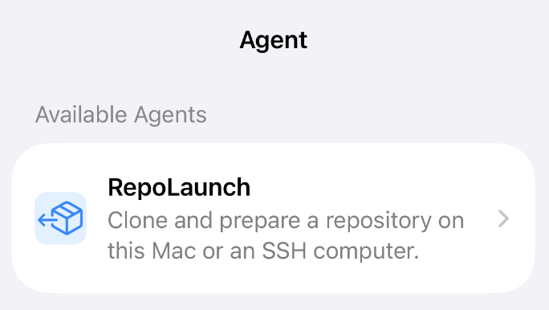

> [English version](README.md)

<p align="center">
  
</p>

# GitAgent

**集 GitHub 浏览、AI 聊天和内置终端于一体的原生应用——支持 iPhone、iPad 和 Mac。**

GitAgent 正在成长为一个面向 Git 的智能体，可以操作你各个设备上的仓库。现在它已经可以用来浏览 GitHub、与 LLM 聊你的代码、打开本地和 SSH 终端、把仓库关联到真实的工作树，以及一张表单完成仓库部署。

## 功能

**浏览你的仓库** —— 通过 GitHub OAuth Device Flow 登录（token 存系统钥匙串）；你自己的、私有的和星标的仓库，外加带贡献图的个人主页。

**阅读与探索代码** —— README 和文件均以完整 Markdown 渲染（数学公式、语法高亮、锚点跳转）；图片（PNG/JPEG/GIF/WebP 等）和 PDF 均有内置查看器；文件、文件夹和仓库的链接全部在应用内打开。

**与 AI 聊你的代码** —— 支持 Kimi Code、Moonshot AI、OpenAI、DeepSeek、Anthropic 或任何兼容 OpenAI 的端点，模型列表自动拉取；输入 `@` 引用仓库，再输入 `/` 附加文件或文件夹；回答流式输出、Markdown 渲染，会话本地持久化，API key 只存钥匙串。

**终端——本地与 SSH** —— macOS 上的原生本地 shell，表现与 Terminal.app 一致（dotfiles、Homebrew、conda 全都能用）；粘贴 `ssh` 命令行即可添加主机，支持密码或应用生成的 Ed25519 密钥、支持跳板机；各平台共用同一个 xterm.js 终端，凭据只存钥匙串。

**把仓库关联到工作树** —— 将 GitHub 仓库关联到这台 Mac 上的文件夹或 SSH 主机上的路径，并自动验证；打开已连接的位置，直接进入位于该仓库路径的终端。

**用 RepoLaunch 部署仓库** —— 把任意 git URL 克隆到这台 Mac 或 SSH 主机，流程清晰可见（预检 → checkout → setup/build/test → 验证）；绝不覆盖本地修改；部署成功后自动在新的工作树中打开终端。RepoLaunch 是 Agent 目录里的第一个智能体——驱动远程编码 CLI 的任务型智能体正在开发中。

## 应用导览

### macOS

*登录后首先看到你的仓库——自己的、私有的和星标的，每行右侧是终端位置状态标记。*

<p>
  
</p>

*打开一个仓库：README 以完整 Markdown 渲染，Files 标签页可以浏览目录树并显示最近提交信息。*

<p>
  
  
</p>

*Chat 标签页与你选择的 LLM 对话——输入 `@` 引用仓库，再输入 `/` 附加文件或文件夹。*

<p>
  
</p>

*Terminal 标签页列出 This Mac（原生本地 shell）和你保存的 SSH 主机。*

<p>
  
</p>

*仓库位置把 GitHub 仓库关联到经过验证的工作树——在这台 Mac 上或某台 SSH 主机上。*

<p>
  
</p>

*Agent 目录：RepoLaunch 是目前唯一可用的智能体——它在本地或通过 SSH 克隆并准备好一个仓库。更多智能体正在开发中。*

<p>
  
  
</p>

*设置：字号，以及 AI 聊天的提供商、Base URL 和模型。*

<p>
  
</p>

### iOS

*iPhone 上的同一个应用：主页显示你的账号，往下是仓库列表。*

<p>
  
  
</p>

*README 渲染和文件浏览器，与 Mac 版一致。*

<p>
  
  
</p>

*终端主机——支持多跳路由（"Via 5090" 表示经由跳板机访问这台 Mac）——以及带有 RepoLaunch 的 Agent 目录。*

<p>
  
  
</p>

*iOS 上的设置：字号和 AI 聊天配置。*

<p>
  
</p>

## 环境要求

- iOS 26+ / macOS 15.7+
- 从源码构建需要 Xcode 26+
- 运行 RepoLaunch 部署的机器需要 `tmux`（macOS：`brew install tmux`）

## 配置

GitHub 登录使用 OAuth Device Flow，需要你自己的 OAuth App：

1. 打开 <https://github.com/settings/developers> → **OAuth Apps** → **New OAuth App**（名称随意，URL 可填占位值），然后在该应用的设置中启用 **Device Flow**。
2. 创建两个**被 gitignore 的**文件，填入你的个人值：

   项目根目录的 `Local.xcconfig`（Apple 签名）：

   ```
   DEVELOPMENT_TEAM = ABCDEFGHIJ        # 你的 Apple team ID（iOS 真机需要）
   CODE_SIGN_IDENTITY[sdk=macosx*] = Apple Development
   ```

   `GitAgent/Auth/LocalSecrets.swift`（GitHub OAuth）：

   ```swift
   enum GitAgentSecrets {
       static let clientID = "Ov23..."  // 你的 OAuth App Client ID
   }
   ```

3. 打开 `GitAgent.xcodeproj`，选择 **My Mac** 或 iPhone 模拟器，运行（⌘R）。

**AI 聊天（可选）：** 打开 Settings → **AI Chat**，选择提供商并粘贴你的 API key。Base URL 和模型会自动填充；密钥只存钥匙串。

## 文档

架构、路线图、项目结构和开发笔记都在 [`GitAgent/Docs/`](GitAgent/Docs/)——从 [Development.zh.md](GitAgent/Docs/Development.zh.md) 开始。

## 许可证

GPL-3.0 —— 见 [LICENSE](LICENSE)。
